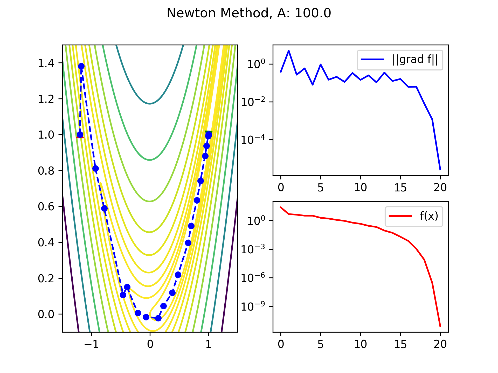

# opti
n-dimensional unconstrained optimization using [linalgcpp](https://github.com/gelever/linalgcpp) as the linear algebra framework.

# Requirements
* [linalgcpp](https://github.com/gelever/linalgcpp)
* python3 - Plot outputs

# Project Goal
Implement n-dimensional extension of homework assignments assigned in MTH 510.
Use generalized [Rosenbrock function](https://en.wikipedia.org/wiki/Rosenbrock_function) as test case.
Currently implemented:
* [Linesearch](examples/linesearch.cpp):
  * Steepest Descent
  * Newton method
* [Trust Region](examples/trustregion.cpp):
  * Dogleg 

# Sample Output
From the [results](results) directory:
```txt
Program Options:
  --A               100       A in Rosenbrock Function
  --alpha           1         Inital alpha in linesearch
  --alpha-max-iter  20        Maximum iterations in linesearch
  --c               0.01      C factor in linesearch
  --dim             2         Dimensions
  --hist            false     Save iteration history
  --initial-x       Standard  Set initial x [Standard, Random]
  --iter            20000     Max iterations
  --method          Newton    Method to use: [Newton, SteepestDescent, Dynamic]
  --rho             0.5       Reduction factor in linesearch
  --tol             0.001     Solve tolerance.
  --var             0.05      Inital vector uniform random variance about solution
  --verbose         true      Show iteration information
1: f: 2.42e+01 p: 3.81e-01 e: 2.21e+00 alpha: 1.00e+00 grad*p: -3.88e+01 cg: 4
2: f: 4.73e+00 p: 4.95e+00 e: 1.94e+00 alpha: 1.25e-01 grad*p: -8.43e+00 cg: 4
3: f: 4.09e+00 p: 2.68e-01 e: 1.83e+00 alpha: 1.00e+00 grad*p: -1.28e+00 cg: 4
4: f: 3.23e+00 p: 5.80e-01 e: 1.71e+00 alpha: 1.00e+00 grad*p: -1.25e+00 cg: 4
5: f: 3.21e+00 p: 7.93e-02 e: 1.63e+00 alpha: 1.00e+00 grad*p: -2.36e+00 cg: 4
6: f: 1.94e+00 p: 9.32e-01 e: 1.56e+00 alpha: 2.50e-01 grad*p: -2.05e+00 cg: 4
7: f: 1.60e+00 p: 1.46e-01 e: 1.47e+00 alpha: 1.00e+00 grad*p: -6.23e-01 cg: 4
8: f: 1.18e+00 p: 2.08e-01 e: 1.34e+00 alpha: 1.00e+00 grad*p: -5.28e-01 cg: 4
9: f: 9.22e-01 p: 1.12e-01 e: 1.23e+00 alpha: 1.00e+00 grad*p: -5.25e-01 cg: 4
10: f: 5.97e-01 p: 3.31e-01 e: 1.08e+00 alpha: 5.00e-01 grad*p: -4.70e-01 cg: 4
11: f: 4.53e-01 p: 1.43e-01 e: 9.38e-01 alpha: 1.00e+00 grad*p: -2.60e-01 cg: 4
12: f: 2.81e-01 p: 2.48e-01 e: 6.96e-01 alpha: 1.00e+00 grad*p: -2.01e-01 cg: 4
13: f: 2.11e-01 p: 1.07e-01 e: 5.89e-01 alpha: 1.00e+00 grad*p: -2.17e-01 cg: 4
14: f: 8.90e-02 p: 3.47e-01 e: 4.16e-01 alpha: 5.00e-01 grad*p: -1.20e-01 cg: 4
15: f: 5.15e-02 p: 1.25e-01 e: 2.92e-01 alpha: 1.00e+00 grad*p: -4.92e-02 cg: 4
16: f: 2.00e-02 p: 1.60e-01 e: 1.32e-01 alpha: 1.00e+00 grad*p: -2.42e-02 cg: 4
17: f: 7.17e-03 p: 6.08e-02 e: 7.13e-02 alpha: 1.00e+00 grad*p: -1.06e-02 cg: 4
18: f: 1.07e-03 p: 6.21e-02 e: 9.18e-03 alpha: 1.00e+00 grad*p: -1.90e-03 cg: 4
19: f: 7.78e-05 p: 8.01e-03 e: 1.17e-03 alpha: 1.00e+00 grad*p: -1.52e-04 cg: 4
20: f: 2.82e-07 p: 1.17e-03 e: 2.73e-06 alpha: 1.00e+00 grad*p: -5.64e-07 cg: 4
21: f: 8.52e-12 p: 2.73e-06 e: 1.35e-10 alpha: 1.00e+00 grad*p: -1.70e-11 cg: 4
f(x): 8.52e-12 Iter: 21 Total Function Evals: 49
```


